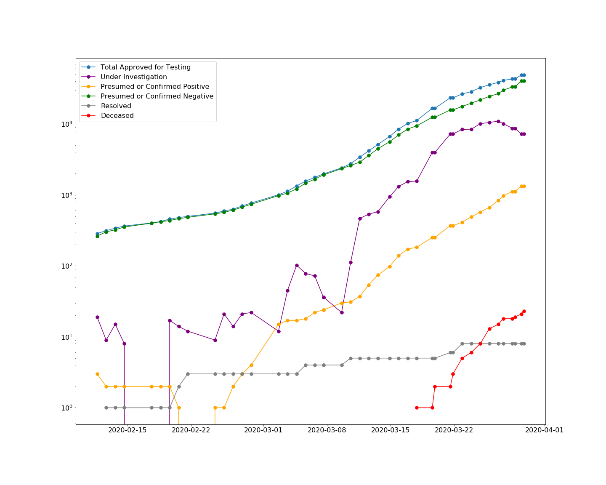

# COVID-ontario

Visualization and tracking of COVID data releases from the Ontario Ministry of Health and Long-term Care (MOHLTC) available here from the 2019 Novel Coronavirus page: https://www.ontario.ca/page/2019-novel-coronavirus

@author mylesmharrison (myles at mylesharrison dot com)



### Notes on the data
This also relies on data gathered by the MIDAS Network, available here: https://github.com/midas-network/COVID-19/tree/master/data/cases/canada/ontario_situation_updates

#### Historical changelog
2020-03-30 Changeover from regular case statuses to iPHIS format

#### Excel format
`excel/2019-novel-coronavirus-MOHLTC-updates.xlsx`:  
These updates were saved manually by myself for the 10:30 and 17:30 updates from 2020/03/23 - 2020/03/29  
Data prior to 03/23 was backfilled from the data from the same source saved by MIDAS  
After changes in reporting on 2020/03/30, saved only daily  

#### csv
`csv/midas_processed/case_statuses_2020-03-xx.csv`:  
These are consolidated and processed files of the MIDAS data via python (currently in jupyter only)

`csv/2019-novel-coronavirus_2020mmyy_hhmmss.csv`:
These files are single-line extracts from the HTML done via the python scraper/data extraction script

#### HTML
Archived via python scraper with data update frequency beginning on 2020/03/28

### Web Scraping

The web scraper requires the [geckodriver](https://github.com/mozilla/geckodriver/releases/tag/v0.26.0) executable to be in a directory in your PATH

**Usage:**

1. Scrape page and save both HTML and csv
    ```bash
    python py/MOHLTC_covid19_scrape.py
    ```

2. Extract from previously saved HTML
    ```bash
    python py/MOHLTC_covid19_scrape.py --fromfile html/2019-novelcoronavirus_20200329_104219.html
    ```


### TO DO

- <s>Add python scraper using `pd.read_html()`</s>
- <s>Split python scaper into separate python file and automate csv generation</s>
- 2020-03-30 Update scaper to account for schema change (iPHIS)
- Test automation of web scraper
- Create .py file for batch plot generation / update
- Organize csv output and MIDAS data
- Tableau dashboarding
